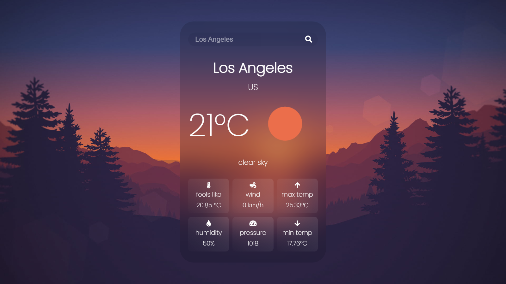

[![Contributors][contributors-shield]][contributors-url]
[![Forks][forks-shield]][forks-url]
[![Stargazers][stars-shield]][stars-url]
[![Issues][issues-shield]][issues-url]
[![MIT License][license-shield]][license-url]
[![LinkedIn][linkedin-shield]][linkedin-url]

<!-- PROJECT LOGO -->
<br />
<p align="center">
  <a href="https://github.com/miladxdev/weather-app-js">
    
  </a>

  <h3 align="center">WEATHER APP</h3>

  <p align="center">
    weather app using vanilla javascript
    <br />
    <a href="https://openweathermap.org/api"><strong>Explore the docs »</strong></a>
    <br />
    <br />
    <a href="https://miladxdev.github.io/weather-app-js/">View Demo</a>
    ·
    <a href="https://github.com/miladxdev/weather-app-js/issues">Report Bug</a>
    ·
    <a href="https://github.com/miladxdev/weather-app-js/issues">Request Feature</a>
  </p>
</p>

<!-- TABLE OF CONTENTS -->
<details>
  <summary><h2 style="display: inline-block">Table of Contents</h2></summary>
  <ol>
    <li>
      <a href="#about-the-project">About The Project</a>
      <ul>
        <li><a href="#built-with">Built With</a></li>
      </ul>
    </li>
    <li>
      <a href="#getting-started">Getting Started</a>
      <ul>
        <li><a href="#prerequisites">Prerequisites</a></li>
        <li><a href="#installation">Installation</a></li>
      </ul>
    </li>
    <li><a href="#usage">Usage</a></li>
    <li><a href="#roadmap">Roadmap</a></li>
    <li><a href="#contributing">Contributing</a></li>
    <li><a href="#license">License</a></li>
    <li><a href="#contact">Contact</a></li>
    <li><a href="#acknowledgements">Acknowledgements</a></li>
  </ol>
</details>

<br>
<!-- ABOUT THE PROJECT -->

## About The Project

`screenshot`



### [Live preview ☝](https://miladxdev.github.io/weather-app-js/)

This project is a weather web app. you can check your current location weather or search any country or city 🌞

### Built With

- [HTML]()
- [CSS]()
- [JavaScript]()
- API (open weather)
<!-- GETTING STARTED -->

## Getting Started

To get a local copy up and running follow these simple steps.

### Installation

1. Get a free API Key at [openweathermap.org/api](https://openweathermap.org/api)

2. Clone the repo

   ```sh
   git clone https://github.com/miladxdev/weather-app-js
   ```

3. Enter your API in `app.js`

   ```JS
   let weather = {
    apiKey: "your api key",
    // ...

    }
   ```

<hr>

## Roadmap

See the [open issues](https://github.com/miladxdev/weather-app-js_name/issues) for a list of proposed features (and known issues).

<!-- CONTRIBUTING -->

## Contributing

Contributions are what make the open source community such an amazing place to be learn, inspire, and create. Any contributions you make are **greatly appreciated**.

1. Fork the Project
2. Create your Feature Branch (`git checkout -b feature/AmazingFeature`)
3. Commit your Changes (`git commit -m 'Add some AmazingFeature'`)
4. Push to the Branch (`git push origin feature/AmazingFeature`)
5. Open a Pull Request

<!-- LICENSE -->

## License

Distributed under the MIT License. See `LICENSE` for more information.

<!-- CONTACT -->

## Contact

`Milad Gharibi` - [@twitter](https://twitter.com/twitter_handle) - miladxgh@gmail.com

Project Link: [github.com/miladxdev/weather-app-js](https://github.com/miladxdev/weather-app-js)

<!-- MARKDOWN LINKS & IMAGES -->
<!-- https://www.markdownguide.org/basic-syntax/#reference-style-links -->

[contributors-shield]: https://img.shields.io/github/contributors/miladxdev/weather-app-js.svg?style=for-the-badge
[contributors-url]: https://github.com/miladxdev/weather-app-js/graphs/contributors
[forks-shield]: https://img.shields.io/github/forks/miladxdev/weather-app-js.svg?style=for-the-badge
[forks-url]: https://github.com/miladxdev/weather-app-js/network/members
[stars-shield]: https://img.shields.io/github/stars/miladxdev/weather-app-js.svg?style=for-the-badge
[stars-url]: https://github.com/miladxdev/weather-app-js/stargazers
[issues-shield]: https://img.shields.io/github/issues/miladxdev/weather-app-js.svg?style=for-the-badge
[issues-url]: https://github.com/miladxdev/weather-app-js/issues
[license-shield]: https://img.shields.io/github/license/miladxdev/weather-app-js.svg?style=for-the-badge
[license-url]: https://github.com/miladxdev/weather-app-js/blob/master/LICENSE.txt
[linkedin-shield]: https://img.shields.io/badge/-LinkedIn-black.svg?style=for-the-badge&logo=linkedin&colorB=555
[linkedin-url]: https://www.linkedin.com/in/milad-gharibi-507ba3214/
